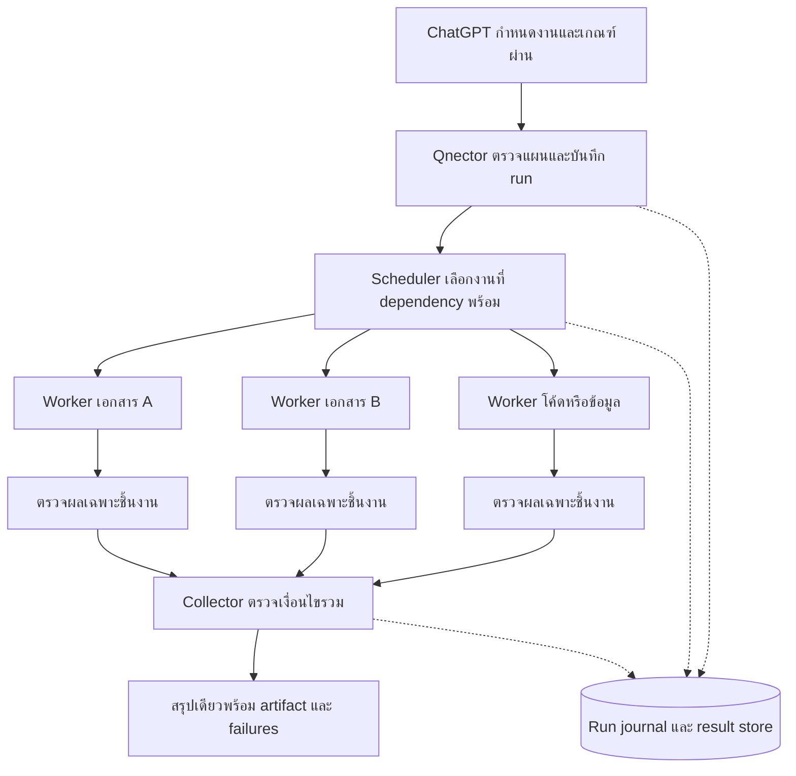

# Qnector: รายงาน QC และแนวทางพัฒนา Harness

วันที่ตรวจ: 12 กันยายน 2026 · รุ่นใน checkout: 0.4.22 · Git HEAD: `e28a0269e1df2a7b1202324e41ffbcc55d4f31d7`

ขอบเขต: ตรวจ source, ทดสอบบน Windows เครื่องนี้, ทดลองปัญหาในโฟลเดอร์ชั่วคราว และเทียบเอกสารต้นฉบับของเครื่องมือที่เกี่ยวข้อง โดยเน้นงานเอกสาร งานหลายขั้นตอน งาน coding และ computer use

## ข้อเสนอหลัก

**ควรพัฒนา Qnector จากชุดเครื่องมือที่เรียกทีละคำสั่ง ให้เป็นตัวจัดการงานที่รับแผนหนึ่งครั้ง รันงานอิสระพร้อมกัน เก็บผลแยกรายงาน และตรวจผลรวมเมื่อ dependencies พร้อม** จุดนี้ตอบโจทย์ผู้ใช้มากกว่าการลดเวลาค้นหาอีกหลักสิบมิลลิวินาที

แนวทางที่เหมาะกับโครงสร้างปัจจุบันคือ **ต่อยอด `WorkflowManager` + `ProcessManager` + `ToolRegistry` ที่มีอยู่** ให้เป็น workflow แบบกราฟ ไม่ต้องเพิ่ม framework orchestration ขนาดใหญ่หรือเปลี่ยนจำนวน grouped MCP tools จากแปดกลุ่ม

ลำดับที่แนะนำ:

1. แก้ความถูกต้องของ cancel, resume, retry และการเลือกเป้าหมาย UI ก่อนเปิดงานขนานจำนวนมาก
2. เพิ่ม dependency graph, background run handle, event-based wait และผลลัพธ์ที่อ่านกลับได้
3. เพิ่มการประสานงานของไฟล์/พาธ/session และขั้นตรวจผลที่ผูกกับชิ้นงานจริง
4. เพิ่ม recipe สำหรับเอกสารและ coding; ผูก skill ที่เลือกกับแต่ละงานอย่างตรวจสอบได้
5. ค่อยเพิ่ม LLM worker adapter เมื่อจำเป็นต้องให้หลายโมเดลคิดและแก้โค้ดพร้อมกันจริง ๆ

**สถานะของรายงาน:** มีการแก้ worker pool และจุด QC บางส่วนใน source แล้ว ส่วน workflow แบบกราฟ, artifact pipeline และการปรับ computer use ด้านล่างเป็นข้อเสนอ ยังไม่ได้ติดตั้งหรือพัฒนาเสร็จในรอบนี้

## 1. สิ่งที่ Qnector มีอยู่แล้ว

| ส่วน              | ความสามารถปัจจุบัน                                                                                  | สิ่งที่ยังขาดสำหรับงานของผู้ใช้                                                            |
| ----------------- | --------------------------------------------------------------------------------------------------- | ------------------------------------------------------------------------------------------ |
| `system.parallel` | รับ 2–12 calls, concurrency 1–8, เก็บลำดับผล, ส่งภาพจาก subcalls กลับได้                            | ไม่มี dependency graph, background batch handle หรือกลไกประสานการแก้ไฟล์ร่วมกัน            |
| `process`         | run/start/output, wait, task handles และ ConPTY                                                     | ตัวตนของ process task ยังไม่ใช่ตัวตนของ workflow step ที่มี artifact และ acceptance checks |
| `WorkflowManager` | บันทึก definition/run, command/wait/delay, status/cancel/resume                                     | loop รันทีละขั้น, ไม่มี tool step ทั่วไป, เก็บ command summary สั้น ๆ                      |
| Browser           | ใช้ `playwright-core` อยู่แล้ว รวม auto-wait ของ locator, CDP, tabs, console/network และ screenshot | runtime หลักมี browser instance เดียว; ยังไม่มี session ownership ต่อ job                  |
| Windows UI        | UI Automation helper แบบ persistent, semantic patterns และ state waits                              | ต้องปรับการ replay mutation และ post-action verification                                   |
| เอกสาร            | อ่าน PDF/DOCX/XLSX/CSV/JSON/ZIP/SQLite, render PDF, แก้ text run ใน DOCX/PPTX                       | ไม่มี artifact workflow ที่จัด prepare/edit/validate/render/collect ให้อัตโนมัติ           |
| Skills            | ค้นหา โหลด route และจัดการ local/remote skills; พบ 15 `SKILL.md` ใน `skills/` ของ checkout          | การ route ยังอาศัยข้อความเป็นหลัก และยังไม่มีหลักฐานว่าแต่ละงานใช้ instruction version ใด  |
| Memory v2         | แยก task IDs, events, workspace continuity และรายงานไฟล์ที่หลายงานแตะร่วมกัน                        | บันทึกความขัดแย้งไม่เท่ากับล็อกการเขียน; ไม่ใช่ run journal สำหรับกู้ scheduler            |

หลักฐาน: [ToolRegistry](../packages/tools/src/index.ts), [workflow](../packages/core/src/workflow-manager.ts), [browser runtime](../packages/core/src/browser-runtime.ts), [browser tools](../packages/tools/src/browser-tool.ts), [skills](../packages/core/src/agent-skills.ts), [Memory v2](../packages/core/src/memory-v2-store.ts)

## 2. Findings ที่ควรให้ความสำคัญ

P0 = ควรแก้ก่อนเปิดงานขนานที่มีการเปลี่ยนข้อมูลอย่างกว้างขวาง; P1 = ความสามารถหลักรอบถัดไป; P2 = ปรับคุณภาพ/ประสิทธิภาพรอง

| ID  | ระดับ | หลักฐานและผลกระทบ                                                                                                                                                                  | สถานะ                                                                                             |
| --- | ----- | ---------------------------------------------------------------------------------------------------------------------------------------------------------------------------------- | ------------------------------------------------------------------------------------------------- |
| H01 | P1    | เดิม PowerShell cache มี worker เดียวต่อ executable และ worker มี serial queue ทำให้ `system.parallel` ยัง serialize คำสั่ง PowerShell ที่เข้าทาง persistent worker                | **แก้แล้ว:** pool สูงสุด 4 workers พร้อม queue แบบเลือก worker ที่งานน้อยสุด                      |
| H02 | P0    | `WorkflowManager.cancel()` เปลี่ยน state แต่ไม่หยุดคำสั่งที่กำลังทำงาน ทดลองแล้ว state เป็น `canceled` แต่คำสั่งยังสร้างไฟล์ภายหลัง                                                | **ยืนยันด้วยการรันจริง; ยังต้องแก้**                                                              |
| H03 | P0    | `resume()` ลบ cancellation flag แล้วเริ่ม execute ใหม่โดยไม่มีการรอ executor เก่าจบ; ส่วน run ที่โหลดจากดิสก์และยังเป็น `running` จะถูก return ทันที                               | **พบจาก source:** เสี่ยงรันซ้ำเมื่อ cancel/resume เร็ว และกู้ run หลัง runtime หยุดไม่ได้ครบ      |
| H04 | P0    | `playwrightLocator()` ใช้ `base.nth(index ?? 0)` ทำให้คำขอที่ match หลายปุ่มเลือกตัวแรกโดยปริยาย                                                                                   | **พบจาก source:** ควรคืน ambiguous-target เมื่อผู้เรียกไม่ได้ระบุ index หรือ scope ให้ชัด         |
| H05 | P0    | `runPersistentHelper()` retry ทุก action หลัง error รวมถึง `invoke`/`toggle`; helper อาจทำ action แล้วก่อน response หายหรือ element หาย                                            | **พบจาก source:** อาจทำ mutation ซ้ำ ควรแยก read retry ออกจาก outcome ที่ยังไม่ทราบ               |
| H06 | P1    | Workflow ใช้ `for` + `await executeStep`; type ของ step เป็น command/wait/delay และเก็บผลหลักเป็น summary สูงสุดประมาณ 800 ตัวอักษร                                                | **ยังต้องพัฒนา:** graph scheduler, tool step, result store และ final collector                    |
| H07 | P1    | Query ไทย `แก้ไขเอกสารและตารางหลายไฟล์แล้วตรวจผล` ไม่พบ skill; English query พบ spreadsheet/document/project-qc                                                                    | **ยืนยันด้วยการรันจริง:** การปรับ semantic search ก่อนหน้านี้ไม่ได้แก้ tokenizer ของ skill router |
| H08 | P1    | `system.parallel` ส่ง subcall failures ในผลรวม แต่ไม่มี run lifecycle; ถ้า handler โยน error ก่อนคืน `ToolResult`, worker Promise สามารถ reject ทั้ง batch ขณะที่ sibling ยังทำงาน | **พบจาก source:** ต้อง settle ทุก subcall และรายงาน partial outcomes อย่างชัดเจน                  |
| H09 | P1    | Browser runtime มี `child`/snapshot เดียว และถ้าไม่ระบุ target จะใช้หน้าแรก; Memory conflict เป็นคำเตือน ส่วน `expectedSha256` เป็น optional precondition                          | **พบจาก source:** งานหลายรายการยังไม่มี ownership ของไฟล์/browser session                         |
| H10 | P2    | Headless Node ถูกระบุเป็น packaged Qnector และใช้ hash/mtime ของ Node เป็น build metadata                                                                                          | **แก้แล้ว:** แยก development และไม่ hash ตัว host เป็น payload                                    |

ตำแหน่งสำคัญขณะตรวจ: `workflow-manager.ts:210,231,258,314`; `browser-tool.ts:1181`; `ui-automation.ts:435`; `agent-skills.ts:274,826`; `tools/src/index.ts:135` เลขบรรทัดอาจเปลี่ยนเมื่อมีการแก้ต่อ

อีกจุดที่ควรตรวจพร้อม H05 คือ `ProcessManager.run()` ยังมี fallback หลัง persistent worker เกิด protocol/startup error แบบกว้าง จึงต้องแยก error ที่ยืนยันว่า command ยังไม่เริ่ม ออกจาก error ที่ไม่ทราบว่า command ทำไปถึงไหนแล้ว รอบนี้แก้เฉพาะกรณีปิด worker pool ให้ไม่รันซ้ำ; การออกแบบ outcome/replay contract ให้ครบยังเป็นส่วนของระยะ A

รันซ้ำ observations H02/H07 ได้ด้วย:

```powershell
npx.cmd pnpm@10.15.0 exec tsx scripts/audit-harness.ts
```

สคริปต์นี้เป็น diagnostic ที่จงใจรายงานช่องว่าง ไม่ใช่ acceptance suite ที่หมายความว่าฟีเจอร์ถูกต้องแล้ว ใช้โฟลเดอร์ชั่วคราวและลบทิ้งหลังตรวจ [ดูสคริปต์](../scripts/audit-harness.ts)

## 3. โครงสร้าง Harness ที่แนะนำ



การแบ่งงานเป็น parallel sections แล้วรวมผล หรือมี orchestrator แบ่งงานให้ workers เป็นรูปแบบที่ใช้ได้ตามลักษณะงาน ใน Qnector ควรเริ่มจากงานที่ ChatGPT กำหนดไว้ล่วงหน้า เพราะ runtime ปัจจุบันไม่เรียก model API เอง ข้อเสนอการเลือกแบบนี้เป็นการประเมินจากโค้ด Qnector ประกอบแนวคิด [Building effective agents](https://www.anthropic.com/engineering/building-effective-agents)

### Contract ขั้นต่ำ

- **Run identity:** `runId`, workspace ที่ตรึงตอนเริ่ม, definition snapshot, `memoryTaskId`, เวลาเริ่ม/จบ
- **Step identity:** `stepId`, `dependsOn`, executor, working directory, timeout, resource paths และ outputs ที่คาดหวัง
- **Scheduling:** bounded concurrency; validate missing dependencies/cycles ก่อนเริ่ม; legacy workflow ยังคง sequential เป็นค่าเริ่มต้น
- **Results:** exit code หรือ tool outcome, stdout/stderr แยกกัน, result artifact, error, attempt และ verification status
- **State:** pending/running/canceling/succeeded/failed/canceled/interrupted/skipped; อย่าเรียกว่ายกเลิกสำเร็จก่อน executor สิ้นสุด
- **Failure:** เก็บผลทุกงาน งานที่ dependency ล้มเหลวต้อง skipped พร้อมเหตุผล; งานอิสระอื่นทำต่อได้; collector ต้องเห็น failures ทั้งหมด
- **Recovery:** runtime ที่กลับมารู้ว่า run ใด interrupted; ไม่ replay mutation แบบอัตโนมัติเพียงเพราะเคยถูกบันทึกว่า running

เริ่มเก็บ definition/run/result ใน `.qnector` ด้วย atomic writes และคิวเขียนต่อ run ตามแนวทางที่มีอยู่ก่อน ไม่ต้องย้ายทั้งหมดไปฐานข้อมูลใหม่ทันที เมื่อ concurrent runs และ recovery มีข้อกำหนดชัดจึงประเมินการใช้ SQLite ที่โปรเจ็คมีอยู่แล้ว

### API ที่เสนอ — ยังไม่ใช่ API ที่ใช้งานได้ในรุ่นนี้

| Action ในกลุ่ม `process` | หน้าที่                                                                         |
| ------------------------ | ------------------------------------------------------------------------------- |
| `workflow_run`           | ส่งแผนพร้อมเริ่มงานในครั้งเดียว แล้วคืน `runId` ทันที                           |
| `workflow_wait`          | รอ run จบหรือถึงเวลาที่กำหนดแบบ event-based; timeout การรอไม่ยกเลิก run         |
| `workflow_result`        | อ่านผลรวมแบบย่อ หรือผลเต็มของ step ที่เลือก                                     |
| `workflow_cancel`        | หยุด scheduling, ยกเลิก/รอ active executors และยืนยันผลการหยุด                  |
| `workflow_resume`        | ใช้ definition snapshot เดิมและเริ่มจากงานที่เหมาะสม โดยไม่รันงานที่ผ่านแล้วซ้ำ |

ตัวอย่าง payload ที่เสนอ สำหรับงานเตรียมเอกสารสองชุดและตรวจผลรวม:

```json
{
  "action": "workflow_run",
  "workflowName": "document-batch",
  "mode": "graph",
  "maxConcurrency": 3,
  "steps": [
    {
      "id": "doc-a",
      "type": "command",
      "command": "python scripts/edit_document.py inputs/a.docx outputs/a.docx",
      "dependsOn": [],
      "resourcePaths": ["outputs/a.docx"],
      "outputs": ["outputs/a.docx"]
    },
    {
      "id": "doc-b",
      "type": "command",
      "command": "python scripts/edit_document.py inputs/b.docx outputs/b.docx",
      "dependsOn": [],
      "resourcePaths": ["outputs/b.docx"],
      "outputs": ["outputs/b.docx"]
    },
    {
      "id": "verify",
      "type": "command",
      "command": "python scripts/verify_documents.py outputs/a.docx outputs/b.docx",
      "dependsOn": ["doc-a", "doc-b"],
      "outputs": ["outputs/qc.json"]
    }
  ]
}
```

ชื่อสคริปต์ในตัวอย่างเป็นส่วนของ recipe ที่ต้องมีจริงก่อนส่งแผน ไม่ได้สร้างไว้ใน checkout นี้ การตรวจผลไม่จำเป็นต้องรอทุกไฟล์เสร็จเสมอไป: เมื่อ A เสร็จให้ตรวจ A ขณะที่ B ยังทำงาน แล้วค่อยรวมผลรอบสุดท้าย จะลดเวลารอบงานได้มากกว่า barrier เดียวหลังทุกงานเสร็จ

### การประสานงานเขียนข้อมูล

แยก **resource coordination** ออกจาก permissions: Qnector ยังคง full access ตาม AGENTS.md แต่ scheduler ไม่ควรปล่อยสองงานเขียนปลายทางเดียวกันโดยไม่ประสานกัน

- ไฟล์คนละปลายทางทำพร้อมกันได้; ไฟล์เดียวกันหรือ directory ที่ครอบกันต้องจัดลำดับ
- Shell commands ต้องประกาศไฟล์ที่แก้ เพราะ runtime วิเคราะห์ side effects ของ shell ทั่วไปได้ไม่ครบ
- Tool steps ที่รู้ source/destination อยู่แล้วควรอนุมาน resource paths ได้
- `expectedSha256` ช่วยตรวจว่าฐานข้อมูลไฟล์เปลี่ยน แต่ check-then-write เพียงอย่างเดียวไม่ใช่ atomic compare-and-swap; ใช้ควบคู่กับการประสาน writers
- ล็อกมีผลเฉพาะงานที่ผ่าน scheduler เดียวกัน; โปรแกรมภายนอกและ editor ของผู้ใช้ยังเปลี่ยนไฟล์ได้ จึงต้องตรวจ revision อีกครั้งก่อน promote output

## 4. งานเอกสารและ spreadsheet: ให้ผลสำเร็จผูกกับชิ้นงาน

สิ่งที่ควรเพิ่มก่อนคือ recipe `prepare → edit → validate → render → collect` ที่ต่อเข้ากับ workflow graph โดยใช้ providers ปัจจุบัน ไม่ใช่เพิ่ม prompt ยาวให้โมเดลจำทุกขั้น

| ขั้น     | สิ่งที่ harness ทำ                                                                | หลักฐานที่คืน                                           |
| -------- | --------------------------------------------------------------------------------- | ------------------------------------------------------- |
| Prepare  | ตรวจชนิดไฟล์, provider ที่พร้อม, inputs และ revision; จัด output directory แยกงาน | input manifest และ capability result                    |
| Edit     | เลือก native tool หรือสคริปต์ที่เข้าใจ format; คนละไฟล์รันพร้อมกัน                | output path และ process/tool result                     |
| Validate | เปิดไฟล์กลับ; ตรวจสิ่งที่ผู้ใช้ต้องการจริง                                        | content assertions, row/sheet counts, replacement count |
| Render   | render หน้าหรือ sheet ที่เกี่ยวข้องเมื่อ layout มีความหมาย                        | ภาพ/PDF preview และสถานะ visual review                  |
| Collect  | ตรวจว่าชิ้นงานครบและ validations ผ่านก่อนสรุป                                     | manifest เดียว แยก passed/failed/unverified             |

เกณฑ์สำคัญสำหรับ DOCX/PPTX: ตรวจจำนวนตำแหน่งที่แก้, style/paragraph/table/slide ที่ต้องคงไว้ และภาพหน้าที่เปลี่ยน การแทน text ใน Qnector ตอนนี้รองรับข้อความภายใน text run เดียว และคืน error เมื่อข้อความคร่อมหลาย run จึงยังต้องมี structure-aware editor สำหรับกรณีดังกล่าว [implementation](../packages/tools/src/files-tool.ts)

สำหรับ XLSX: ตรวจ sheet names, formulas, merged cells และส่วนที่ต้องเก็บไว้; ถ้าคำนวณสูตรใหม่ไม่ได้ ให้มีสถานะ `recalculation: unavailable` แยกจากความสำเร็จของการเขียนไฟล์ การมีไฟล์และ exit code 0 อย่างเดียวไม่ยืนยันว่า workbook ถูกต้องตามงาน [skill ที่มีอยู่](../skills/spreadsheet-workflows/SKILL.md)

สำหรับ PDF: แยก content extraction ออกจาก visual QC และระบุหน้าที่ตรวจจริง [skill เอกสารที่มีอยู่](../skills/document-workflows/SKILL.md)

หากต้องใช้ Word/Excel desktop ให้มี worker lane เฉพาะแอปหรือ instance นั้น; ไม่สั่งหลายงานคลิก/พิมพ์บนหน้าต่างเดียวพร้อมกัน งานเตรียมข้อมูล/render ที่เป็นอิสระยังทำขนานด้านข้างได้

## 5. Coding และความหมายของ subagent

มีสองความสามารถที่ควรแยกใน design:

| ความสามารถ                | ทำอะไรได้                                                         | สิ่งที่ต้องเพิ่ม                                                                  |
| ------------------------- | ----------------------------------------------------------------- | --------------------------------------------------------------------------------- |
| Parallel execution        | shell, extraction, conversion, build, test และ tool calls หลายงาน | worker pool + scheduler + result collection                                       |
| Parallel reasoning agents | workers หลายตัวอ่านโจทย์ ตัดสินใจ แก้โค้ดและปรับแผนเอง            | host/model adapter, context ต่อ worker, file ownership และ review/merge lifecycle |

worker pool ที่แก้ในรอบนี้เป็นแบบแรก การเปิด shell สี่ตัวไม่ได้ทำให้มี AI สี่ตัวโดยอัตโนมัติ

สำหรับ coding ให้เริ่มจาก recipe ที่มีอยู่จริง: สำรวจ repo → แบ่งงานตาม file ownership → ทำงานแยก → ตรวจแต่ละงาน → รวม changes → ตรวจทั้งระบบ การกู้ context ควรยึด task acceptance list, diff และผลทดสอบที่บันทึกไว้ แนวคิดการเก็บ progress และหลักฐานตรวจผลสอดคล้องกับ [Effective harnesses for long-running agents](https://www.anthropic.com/engineering/effective-harnesses-for-long-running-agents)

เมื่อต้องมี agent workers จริง แนะนำแยก Git worktree ต่อ coding task, branch ต่อ worker และให้ integrator คนเดียวจัดการการรวม changes พร้อมรายงาน conflicts ทั้งนี้ worktree เป็นความสามารถของ Git ที่ให้หลาย working trees ใช้ repository เดียวกัน ไม่ต้องสร้างระบบ snapshot โค้ดใหม่ [Git worktree](https://git-scm.com/docs/git-worktree)

ใช้ `process` เรียก Git worktree ได้อยู่แล้ว จึงยังไม่จำเป็นต้องเพิ่ม MCP tool ใหม่เพื่อทำสิ่งเดียวกัน ขั้นแรกควรเพิ่ม recipe ที่บันทึก base revision, workspace/worktree, owned paths และ validation commands ลงใน run

สำหรับ LLM adapter ให้เริ่มแบบ opt-in กับ agent CLI ที่ผู้ใช้มีอยู่และเลือกใช้ เก็บ session ID และผลลัพธ์ตาม contract เดียวกัน อย่าเริ่มด้วยการสร้างระบบเลือกโมเดล ค่าใช้จ่าย และหลาย provider ทั้งหมดพร้อมกัน

## 6. Skills ที่ควรใช้หรือทดลอง

| ตัวเลือก                                                             | ข้อเสนอสำหรับ Qnector                                                            | เหตุผล/ข้อจำกัด                                                                                                 |
| -------------------------------------------------------------------- | -------------------------------------------------------------------------------- | --------------------------------------------------------------------------------------------------------------- |
| **Ponytail**                                                         | ทดลอง instruction สำหรับ coding แบบสั้น และ `ponytail-review` ในขั้น review      | ช่วย reuse โค้ดเดิม ลด abstraction/dependency ที่ไม่จำเป็น; ไม่ได้เพิ่ม concurrency หรือ executor               |
| **Superpowers**                                                      | เลือกเฉพาะแนวทาง debugging, verification, review และการแบ่งงาน                   | มี workflow กว้างและ subagent-oriented development; ไม่ควรโหลดทุก skill หรือยก lifecycle ของ host อื่นมาทั้งชุด |
| `typescript-best-practices`, `electron-best-practices`, `project-qc` | ใช้ของที่มีใน repo เป็นฐาน                                                       | ไม่ต้องติดตั้ง duplicate skills; route ตามภาษา/ชนิดงาน และให้ QC criteria เฉพาะ task                            |
| `document-workflows`, `spreadsheet-workflows`                        | ยกระดับจากข้อความแนะนำเป็น executable recipes                                    | แนวทางตรวจผลมีอยู่แล้ว แต่ runtime ยังไม่จัดขั้นตอนให้                                                          |
| **Playwright CLI + Skills / MCP**                                    | ใช้เป็น reference และ adapter ทางเลือกเมื่อมีเหตุผล                              | Qnector ใช้ Playwright อยู่แล้ว; ควรพัฒนา surface ที่มีอยู่ก่อนเพิ่ม browser stack อีกตัว                       |
| **agent-browser**                                                    | ศึกษา session isolation และ tab binding; ทดลองเฉพาะกรณีที่เหนือกว่า adapter เดิม | มี isolated sessions และ tab pinning ที่ตรงกับปัญหา concurrent browser jobs                                     |

Ponytail ต้นฉบับเน้นอ่าน flow ก่อนแก้ เลือกโค้ดที่มีอยู่/stdlib/native features ก่อนเขียนใหม่ และไม่ตัด validation หรือ error handling ที่จำเป็น ข้อเสนอคือให้ทดลองกับงานของ Qnector ก่อน ไม่ใช้ตัวเลขโฆษณาประสิทธิภาพของโครงการเป็นค่าที่คาดว่าจะได้กับ ChatGPT/Qnector [Ponytail skill ต้นฉบับ](https://raw.githubusercontent.com/DietrichGebert/ponytail/main/skills/ponytail/SKILL.md)

Ponytail แจกทั้ง skill และ integrations ที่ใช้ lifecycle hooks ในบาง hosts แต่ Qnector ตอนนี้โหลด instruction body ผ่าน skill tools จึงไม่ควรถือว่าการนำ `SKILL.md` มาวางทำให้ hooks หรือพฤติกรรม every-turn ของ host ต้นทางทำงานตามมาด้วย [Ponytail repository](https://github.com/DietrichGebert/ponytail)

Superpowers เป็นชุด methodology และ composable skills พร้อมขั้น planning/development/review; เลือกบางส่วนที่ช่วย workflow ได้ แล้วให้ user intent ของ Qnector เป็นตัวกำหนดระดับพิธีการ [Superpowers repository](https://github.com/obra/superpowers)

Microsoft อธิบาย tradeoff ระหว่าง CLI+skills ที่ช่วยลด schema/context overhead กับ MCP ที่เหมาะกับ persistent interactive browser state จึงไม่มีเหตุผลให้เปลี่ยนทั้งระบบโดยยังไม่ได้วัดงานจริง [Playwright MCP / CLI](https://github.com/microsoft/playwright-mcp)

agent-browser แสดงรูปแบบ session แยกและการ pin tab ที่นำมาเป็นเกณฑ์ออกแบบได้ โดยไม่จำเป็นต้องคัดลอกแนวทางจัดการโปรไฟล์ทั้งหมด [agent-browser sessions](https://github.com/vercel-labs/agent-browser#sessions)

### ปรับ skill routing ก่อนเพิ่มจำนวน skill

1. เพิ่ม task metadata เช่น format, language, operation และ Thai aliases; reuse Unicode segmentation ที่เหมาะสม
2. ทดสอบคู่โจทย์ไทย/อังกฤษที่มี intent เดียวกัน ไม่พึ่งให้โมเดลเติม English hint ทุกครั้ง
3. โหลดเฉพาะ skills ที่ตรงกับงาน; metadata ก่อน แล้ว instruction/resource เมื่อจำเป็น ตาม [Agent Skills specification](https://agentskills.io/specification#progressive-disclosure)
4. บันทึก `skillName`, content hash/version และเหตุผลที่เลือกใน run เพื่อ audit ได้ว่าใช้กฎชุดใด
5. แยกคำว่า enabled, loaded และ used ใน UI/log; การคืนข้อความ skill ไม่ได้พิสูจน์ว่าโมเดลทำตามทุกข้อ
6. เพิ่ม acceptance examples ให้ skill: input fixture → expected artifact/checks; ประเมินคุณภาพผลลัพธ์ ไม่ใช่แค่พบชื่อ skill

รอบนี้ตรวจ Ponytail และแหล่งอ้างอิงเพื่อทำรายงาน ยังไม่ได้ติดตั้ง third-party skills หรือเปลี่ยนการตั้งค่า plugin ของผู้ใช้

## 7. Computer use ที่ควรพัฒนา

ลำดับที่แนะนำตามความเหมาะสมของงาน: **structured file/provider API → Playwright DOM/accessibility → Windows UI Automation → screenshot/coordinate fallback** โดยเลือกตามแอปและสิ่งที่งานต้องพิสูจน์

| ลำดับ | การเปลี่ยนแปลง                                                                | เกณฑ์ตรวจรับ                                                                                    |
| ----- | ----------------------------------------------------------------------------- | ----------------------------------------------------------------------------------------------- |
| 1     | Browser strict target เมื่อไม่ระบุ index; scope ด้วย role/name/container      | หน้า fixture มีสองปุ่มชื่อเหมือนกันต้องไม่คลิกตัวแรกเงียบ ๆ                                     |
| 2     | แยก outcome ของ UI action ออกจากขั้น observe หลัง action; จำกัด replay        | จำลอง response หายหลัง invoke แล้วต้องไม่มี invoke ครั้งที่สองอัตโนมัติ                         |
| 3     | ผูก run กับ browser session/target และ Windows window identity                | สองงานต้องไม่สลับ tab/window โดยไม่ตั้งใจ; target หายต้องรายงาน                                 |
| 4     | รอ postcondition เช่นข้อความใหม่, URL, network response หรือไฟล์ดาวน์โหลด     | เกณฑ์ผ่านเป็นสถานะปลายทาง ไม่ใช่แค่ click method ไม่ throw                                      |
| 5     | เพิ่ม iframe scope, download/dialog handling และ trace/artifact ตามกรณีใช้งาน | fixture ครอบคลุม iframe, popup, download completion และ rerender                                |
| 6     | screenshot fallback สำหรับ controls ที่ไม่มี DOM/UIA ที่ใช้ได้                | ยืนยัน coordinate mapping, DPI/monitor และ screenshot ใหม่ก่อน action; มี postcondition ตามหลัง |

Playwright มี strictness และ locators ที่หาตัวใหม่เมื่อ DOM เปลี่ยนอยู่แล้ว ควรใช้คุณสมบัติเดิมให้ครบ แทนการเลือก `nth(0)` ทุกครั้ง [Playwright locators](https://playwright.dev/docs/locators#strictness) และควรใช้ actionability checks ที่มีอยู่แทน fixed sleep เมื่อทำได้ [Playwright auto-waiting](https://playwright.dev/docs/actionability)

UI Automation patterns เช่น Invoke/Value/SelectionItem เป็นฐานที่เหมาะกับ controls มาตรฐานบน Windows อยู่แล้ว การทำให้ดีขึ้นคือกำหนด state transition และ verification ให้ครบ [Microsoft UI Automation patterns](https://learn.microsoft.com/en-us/dotnet/framework/ui-automation/ui-automation-control-patterns-overview)

**ไม่ควรเพิ่ม concurrent mouse/keyboard writers บน desktop เดียว** ให้มี lane เดียวสำหรับ interaction ที่อาศัย focus; ใช้ parallelism กับงานไฟล์ การประมวลผล และ browser sessions ที่แยกกันจริงแทน

## 8. แผนส่งมอบที่วัดผลได้

| ระยะ               | สิ่งที่ควรส่งมอบ                                                                           | เงื่อนไขผ่าน                                                                                               |
| ------------------ | ------------------------------------------------------------------------------------------ | ---------------------------------------------------------------------------------------------------------- |
| A — ความถูกต้อง    | cancel/resume contract, no blind mutation replay, strict targets, settle-all batch results | cancel แล้วไม่มี delayed write; resume ไม่ซ้ำ; duplicate target ไม่ถูกกด; output ของ sibling ไม่สูญหาย     |
| B — งานหลายขั้นตอน | ต่อ `WorkflowManager` ให้มี graph, resource coordination, tool steps, wait/result API      | 4 independent jobs เริ่มซ้อนกัน; dependencies รอถูก; conflicts ถูก serialize; chat/request จบแต่ run ไปต่อ |
| C — เอกสาร         | artifact manifest, prepare/edit/validate/render recipes และ final collector                | DOCX/XLSX/PDF ตัวอย่างผ่าน assertions; ส่วนที่ตรวจไม่ได้เป็น unverified; รันซ่อมเฉพาะงานที่ล้มเหลวได้      |
| D — Coding/skills  | worktree recipe, skill snapshots, multilingual routing และ targeted review                 | worker แก้ไม่ทับกัน; final integrated tests ผ่าน; โจทย์ไทย/อังกฤษเลือก capability ที่เหมาะสม               |
| E — LLM workers    | adapter สำหรับ agent CLI ที่เลือกใช้เพียงหนึ่งตัวก่อน                                      | session/result/cancel/ownership อยู่ใน contract เดียวกัน; ประเมินคุณภาพเทียบ single-agent                  |

ตัวชี้วัดหลักควรเป็นเวลา **จนงานผ่าน QC**, จำนวน MCP/model round-trips, อัตราผ่านครั้งแรก, งานซ้ำหลัง retry/resume, จำนวนไฟล์ที่ต้องแก้กลับ และ context bytes ของผลลัพธ์ที่ส่งให้โมเดล

เป้าทดสอบเชิง design สำหรับ 4 งาน I/O อิสระ: warm parallel wall time ไม่เกินประมาณ 1.5 เท่าของงานที่ช้าที่สุด บนเครื่องทดสอบที่ไม่มี resource contention เป้านี้ไม่ใช่ SLA ของทุก workflow และไม่คาดหวัง speedup เดียวกันกับงาน CPU หนักหรือแอป Office ที่ต้อง serialize

สำหรับ skill/coding ให้ใช้ชุดงานจริงเดิมซ้ำทั้งมีและไม่มี skill แล้ววัด task success/เวลา/ความถูกต้องของ diff อย่าวัดเพียงจำนวนบรรทัดที่น้อยลง

## 9. สิ่งที่แก้และวัดแล้วในรอบนี้

| รายการ                           | ก่อน/วิธีเทียบ                   | หลัง                                | ความหมาย                                                              |
| -------------------------------- | -------------------------------- | ----------------------------------- | --------------------------------------------------------------------- |
| PowerShell 4 jobs × รอ 1 วินาที  | sequential บน warm host 4,078 ms | parallel 1,018 ms; พบ 4 worker PIDs | ประมาณ 4.01× ใน workload I/O สังเคราะห์นี้; ไม่ใช่ผลทุกงานจริง        |
| Semantic search หลังแก้หนึ่งไฟล์ | 186.22 ms                        | 11.18 ms                            | reuse ดัชนีไฟล์ที่ไม่เปลี่ยน ใน fixture 400 ไฟล์/2,400 chunks         |
| Semantic search ซ้ำ              | 15.11 ms                         | 11.29 ms                            | ผลรองเมื่อเทียบกับลดรอบ model/tool                                    |
| Semantic search ครั้งแรก         | 208.55 ms                        | 234.88 ms                           | ช้าขึ้นในรอบวัดนี้จากการเพิ่มการประมวลผลคำ; ไม่อ้างว่าเร็วขึ้นทุกกรณี |
| Startup                          | เกณฑ์เดิม 3,000 ms               | พร้อมแสดง renderer 419.71 ms        | ผ่านเกณฑ์; ไม่มีการแก้ startup ในรอบนี้                               |

รายละเอียดการแก้:

- PowerShell pool จำกัด 4 workers ต่อ executable, เก็บ output แยก, ป้องกัน events จาก worker เก่ามากระทบ worker ใหม่ และหยุด queued jobs เมื่อปิด pool
- Semantic search อัปเดตเฉพาะไฟล์ที่เปลี่ยน, ปรับคำไทย/identifier, ลด false matches จาก hash collision, รองรับ `offset`/`minScore`, แยก index truncation และผลหน้าถัดไป พร้อมขอบเขต memory/index
- Filename fallback รองรับ quoted paths ที่มีช่องว่าง และ wildcard ไม่จับ suffix ต่อท้ายผิดชนิด
- Headless build identity รายงาน development ถูกต้องและไม่ hash Node host เป็น Qnector payload

สคริปต์วัด: [shell parallel](../scripts/accept-shell-parallel.ts), [search performance](../scripts/accept-search-performance.ts)

ผลก่อน/หลัง search เป็นการรัน fixture เดียวกันคนละรอบบนเครื่องนี้ ไม่ใช่ค่า median จาก benchmark หลายเครื่อง ส่วน shell เปรียบเทียบ sequential/parallel ในโปรเซสเดียวกันหลัง warm pool แล้ว

ผลรอบสุดท้าย: **185 tests ผ่านทั้งหมดใน 31 test files** พร้อม typecheck, lint, production build และ formatting ของไฟล์ที่แก้ผ่าน เพิ่มจาก baseline 166 tests

การตรวจที่ผ่านมา: MCP smoke, P1–P10, P11–P18, P23, browser acceptance, performance acceptance และ startup acceptance ผ่านตามขอบเขตของแต่ละ suite การผ่านชุดทดสอบไม่ได้ลบ findings H02–H09 เพราะยังมีสถานการณ์ที่ suite เดิมไม่ครอบคลุม

Source/build ใน checkout ถูกอัปเดต แต่ยังไม่ได้สร้าง installer/portable release ใหม่ และยังไม่ได้เปลี่ยนโปรแกรมที่ผู้ใช้ติดตั้งอยู่

## 10. ขอบเขตและสิ่งที่ยังต้องตัดสินใจ

- `AGENTS.md` อ้าง `../devq.md` แต่ไม่พบไฟล์ดังกล่าวในเครื่อง จึงยึด README, source และ tests ที่มีอยู่เป็นข้อกำหนดสำหรับ QC ครั้งนี้
- เก็บการแก้เดิมของผู้ใช้ใน `recommend.md` และไฟล์ mockup ไว้ ไม่ได้ใช้เป็นพื้นที่เขียนรายงานนี้
- ยังไม่ได้อ้างผลทดสอบ live ChatGPT connector หรือบัญชีผู้ใช้จาก local MCP acceptance
- รายงานนี้เสนอ migration แบบเพิ่มความสามารถจากของเดิม; API ตัวอย่างสำหรับกราฟยังเป็น design proposal
- ก่อนพัฒนา LLM worker adapter ควรเลือก host/CLI ที่ต้องการใช้จริง ส่วน scheduler สำหรับ shell/tool/document jobs ทำได้โดยไม่ต้องรอการตัดสินใจนี้

ข้อเสนอส่งมอบถัดไปที่คุ้มที่สุดคือ **ระยะ A + B พร้อม document batch recipe หนึ่งงาน**: ยกเลิกได้จริง รันไฟล์หลายชิ้นพร้อมกัน รอ dependencies และคืนรายงาน QC เดียว นี่เป็นชุดที่พิสูจน์ได้ตรงกับปัญหาที่ผู้ใช้ระบุ
